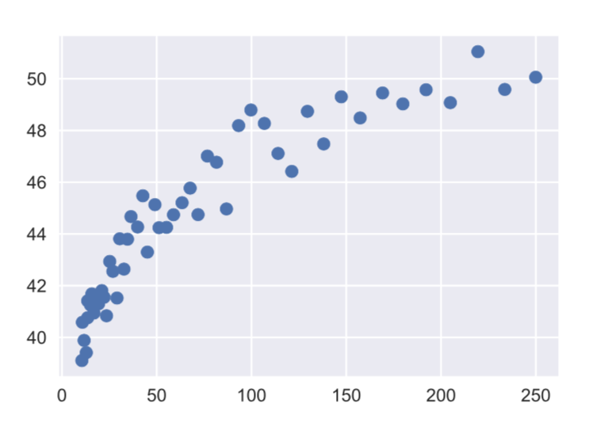

# Applied Machine Learning EPFL Course Work

Course projects completed by me as a part of the EPFL Extension School Applied Machine Learning specialization.

### Project 1 - The Happiness Report

The World Happiness Report is a landmark survey of the state of global happiness. This task demonstrates my experience in the core part of developing a successful machine learning project - data exploration and analysis based on their dataset. The project consists of the following parts:

- importing, cleaning and numerical summaries
- indexing and grouping of data
- creating various plots and histograms
- calculating correlations and probabilities

### Project 2 - The World's Food

Open Food Facts is an open-sourced database of nutritional information for food products. The project is a typical data science task one might expect, which leverages the knowledge of cleaning and manipulating the data, doing time-series analysis, building an SQLite database, and finding correlations. These are the questions this project answers.

1. Investigate the macronutrient breakdown across various foods (this is the percentage of calories that come from the 3 macronutrient groups: carbohydrates, protein and fats). What are the foods that have the highest ratios of each macronutrient? What is the macronutrient breakdown across different countries, etc.
2. Which foods have the highest carbon footprint? Which countries manufacture food, which has the highest carbon footprint? Where is most of the food manufactured?
3. How is the world's food packaged? Which countries package most of their food in plastic? What is the most common packaging in Switzerland?
4. What are the most common ingredients of the world's food?
5. Analyze the mean number of created items per month over the timeline of the data. You will finally choose an appropriate method to visualize these findings.
6. You will build a database to hold your data. It is up to you to define appropriate tables and well as primary keys for connecting them. 
7. You will try to find correlations between the different data fields. Your goal is to identify the variables which most affect the nutritional score and provide some insight into which factors cause both a low or a high nutritional score.

### Project 3 - Linear regression, predicting house prices

This project consists of 2 parts.
#### Warm-up - linear regression
Given the following dataset:

1. Calculate and evaluate the polynomial fit to the data with Numpy.
2. Fit a linear regression with Huber loss and compare results.
3. Apply regularization using ridge regression. Tune the regularization strength using grid search. Compute the train/test RSS of a tuned ridge regression model and plot the new curve.

#### Predicting house prices

Based on data of houses in the city of Ames in Iowa, the task is to create models to predict 500 house prices using the following:
- A "simple" model with two variables (three with the target variable)
- An "intermediate" model (between 10 and 20 variables).
- A "complex model" with all variables.

The project demonstrates, in addition to above, the usage of:
- numerical and one-hot encoding, feature engineering
- building and evaluating various regression models in scikit-learn
- applying regularization, grid search